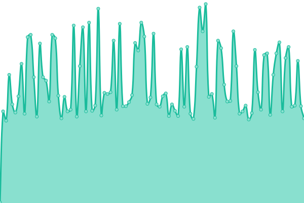
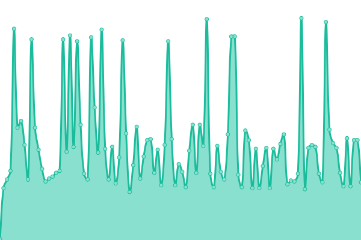
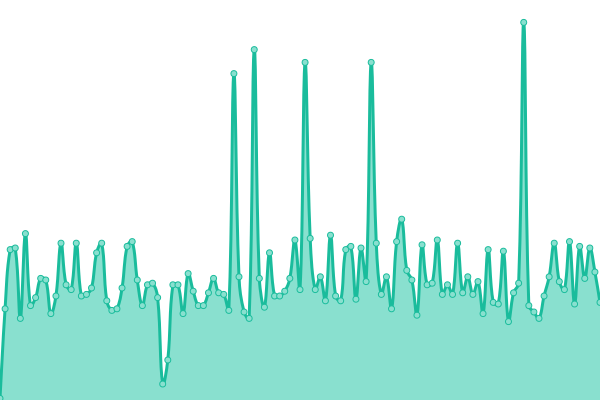

# [📊 Festival Planner Status](https://uhsear.github.io/upptime)

This repository contains the status monitoring infrastructure for [rave.asirkhan.com](https://rave.asirkhan.com) powered by [Upptime](https://github.com/upptime/upptime).

<!--start: status pages-->
<!-- This summary is generated by Upptime (https://github.com/upptime/upptime) -->
<!-- Do not edit this manually, your changes will be overwritten -->
<!-- prettier-ignore -->
| URL | Status | History | Response Time | Uptime |
| --- | ------ | ------- | ------------- | ------ |
|  [Festival Planner](https://rave.asirkhan.com) | 🟥 Down | [festival-planner.yml](https://github.com/uhsear/upptime/commits/HEAD/history/festival-planner.yml) | 

 261ms
     
 | 

<a href="https://status.asirkhan.com/history/festival-planner">100.00%</a>
    

|  [API Health](https://rave.asirkhan.com/api/health) | 🟥 Down | [api-health.yml](https://github.com/uhsear/upptime/commits/HEAD/history/api-health.yml) | 

 112ms
     
 | 

<a href="https://status.asirkhan.com/history/api-health">100.00%</a>
    

|  [Privacy Policy](https://rave.asirkhan.com/privacy) | 🟥 Down | [privacy-policy.yml](https://github.com/uhsear/upptime/commits/HEAD/history/privacy-policy.yml) | 

 79ms
     
 | 

<a href="https://status.asirkhan.com/history/privacy-policy">100.00%</a>
    

<!--end: status pages-->

## 📄 License

- Powered by: [Upptime](https://github.com/upptime/upptime)
- Code: [MIT](./LICENSE)
- Data in the `./history` directory: [Open Database License](https://opendatacommons.org/licenses/odbl/1-0/)
